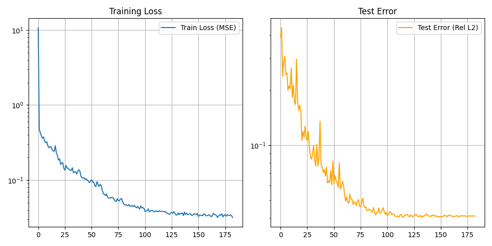
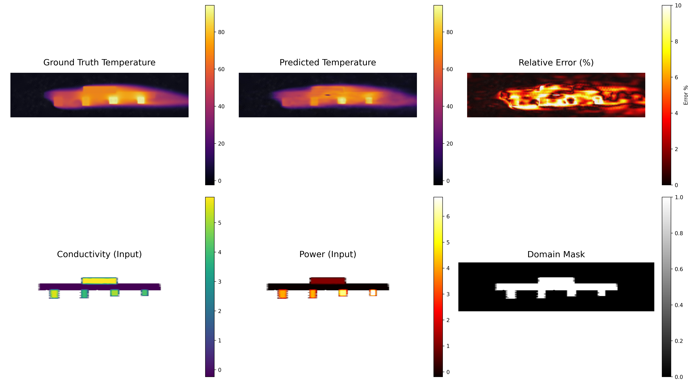

# GeoFNO: Geometric Fourier Neural Operator for Conjugate Heat Transfer


## Table of Contents
1. [Project Overview](#project-overview)
2. [Data Generation: FEM Simulations](#data-generation-fem-simulations)
3. [Neural Network: GeoFNO Architecture](#neural-network-geofno-architecture)
4. [Practical Usage](#practical-usage)
5. [References](#references)

---

## Project Overview

This project combines **Finite Element Method (FEM)** simulations with **Deep Learning** to create a fast surrogate model for conjugate heat transfer problems. The workflow consists of two main components:

1. **Data Generation**: High-fidelity FEM simulations of laminar fluid flow and heat transfer over electronic components
2. **Neural Network**: GeoFNO learns to predict temperature, pressure, and velocity fields from geometry and boundary conditions

**Goal**: Replace expensive FEM simulations (minutes) with instant neural network predictions (milliseconds) while maintaining accuracy.

---

# Data Generation: FEM Simulations

## 1. Simulation Overview

The data generation pipeline simulates **laminar, steady-state airflow** over a Printed Circuit Board (PCB) with mounted electronic components inside a cooling channel. The simulation solves coupled physics:
- **Incompressible Navier-Stokes equations** (fluid flow)
- **Advection-diffusion equation** (heat transfer)

Both are solved using the **Finite Element Method (FEM)** with the `scikit-fem` library.

### Simulated Variables

**Fluid Flow:**
- **Velocity field** ($\mathbf{u}$): Vector field $[u_x, u_y]$ representing fluid speed and direction
- **Pressure field** ($p$): Scalar field representing static pressure distribution

**Heat Transfer:**
- **Temperature field** ($T$): Scalar field representing temperature distribution in both fluid and solid regions

### Fixed Data & Parameters

The physical setup uses properties of **Air at 20°C** and standard PCB geometry:

| Parameter | Value | Description |
| :--- | :--- | :--- |
| **Domain Size** | $20.0 \times 5.0$ m | Rectangular channel |
| **PCB Geometry** | Width: 14.0, Height: 0.25 m | Centered in the domain |
| **Kinematic Viscosity** ($\nu$) | $1.0 \times 10^{-5}$ $m^2/s$ | Air viscosity |
| **Inlet Velocity**| Variable | Parabolic profile |
| **Solid Components** | 5 Components | Modeled as obstacles with heat sources |
| **Thermal Conductivity (Air)** | 0.0263 $W/m\cdot K$ | Air conductivity |
| **Thermal Conductivity (Solid)** | Variable | High conductivity |
| **Power Dissipation** | Variable per component | Heat sources in solids |

**Boundary Conditions:**

*Fluid Flow:*
- **Inlet**: Prescribed parabolic velocity profile
- **Outlet**: Natural boundary condition (traction-free)
- **Walls & Solids**: No-slip condition ($\mathbf{u} = 0$)

*Heat Transfer:*
- **Inlet**: Fixed temperature (ambient)
- **Outlet**: Natural boundary condition
- **Walls**: Adiabatic (no heat flux)
- **Solid Components**: Internal heat generation (power dissipation)

---

## 2. Mesh Generation

The mesh is generated using the **GMSH** Python API. The generation process is handled in `data_generation/generate_mesh.py`.

### Process:

1. **Geometry Definition**: Rectangles are defined for the channel, the PCB, and the 5 electronic components
2. **Fragmentation**: The `gmsh.model.occ.fragment` operation cuts the solid shapes out of the fluid domain. This ensures the mesh is **conformal**—nodes match perfectly at the fluid-solid interfaces
3. **Physical Tagging**: Since IDs change after fragmentation, the script automatically identifies surfaces using their **Center of Mass** to assign physical tags (Fluid, PCB, Inlet, Outlet, etc.)
4. **Discretization**: The domain is meshed with **Quadrilaterals** (via `RecombineAll=1`) to support high-quality tensor product elements

**Why conformal meshes?**
- Ensures continuity of temperature at fluid-solid interfaces
- Enables accurate heat flux calculations
- Simplifies coupling between fluid and thermal solvers

---

## 3. Mathematical Formulation

### 3.1 Fluid Flow Solver (`solve_fluid.py`)

The solver uses **scikit-fem (skfem)** to discretize the weak form of the Navier-Stokes equations.

#### Finite Elements

I used **Taylor-Hood (P2-P1)** elements, which satisfy the LBB (Ladyzhenskaya-Babuska-Brezzi) condition for stability:
- **Velocity**: Quadratic (P2) Quadrilateral elements (`ElementVectorH1(ElementQuad2)`)
- **Pressure**: Linear (P1) Quadrilateral elements (`ElementQuad1`)

**Why Taylor-Hood?**
- Prevents spurious pressure oscillations
- Satisfies inf-sup condition for mixed formulations
- Standard choice for incompressible flow

#### Linearization (Picard Iteration)

The convective term $(\mathbf{u} \cdot \nabla)\mathbf{u}$ is non-linear. I linearize it using **Picard iterations** (Fixed Point iteration):

$$
(\mathbf{u}^{k+1} \cdot \nabla) \mathbf{u}^{k+1} \approx (\mathbf{u}^{k} \cdot \nabla) \mathbf{u}^{k+1}
$$

Where $\mathbf{u}^k$ is the solution from the previous iteration.

### 3.2 Stabilization Techniques

To handle the convection-dominated nature of the flow at lower viscosities (higher Reynolds numbers), standard Galerkin FEM becomes unstable (generating spurious oscillations). I employ a **Variational Multiscale (VMS)** approach with stabilization terms:

#### A. SUPG (Streamline-Upwind Petrov-Galerkin)

Added to stabilize the convective term. It adds numerical diffusion **only in the direction of the flow streamlines**, preventing cross-wind diffusion.

$$
\text{Term}_{\text{SUPG}} = \sum_{K} \tau_K (\mathbf{u}^k \cdot \nabla \mathbf{v}, \mathcal{R}(\mathbf{u}, p))_K
$$

- **Purpose**: Prevents node-to-node oscillations in velocity
- $\tau_K$: Stabilization parameter calculated based on local element size ($h$) and velocity magnitude

#### B. Grad-Div Stabilization

Adds a penalty on the divergence of the velocity test functions.

$$
\text{Term}_{\text{GradDiv}} = \gamma \| \mathbf{u} \| h (\nabla \cdot \mathbf{u}, \nabla \cdot \mathbf{v})
$$

- **Purpose**: Enforces mass conservation more strictly and improves the coupling between velocity and pressure solver blocks

#### C. Penalty Method

A small penalty term $\epsilon p q$ is subtracted from the continuity equation ($-\epsilon p q$).

- **Purpose**: Regularizes the pressure matrix, ensuring solvability even if pressure boundary conditions are not strictly defined (removes the "hydrostatic pressure mode" singularity)

---

### 3.3 Thermal Solver (`solve_thermal.py`)

After solving the fluid flow, the velocity field is used to solve the **advection-diffusion equation** for temperature:

$$
\rho c_p (\mathbf{u} \cdot \nabla T) - \nabla \cdot (k \nabla T) = Q
$$

Where:
- $\mathbf{u}$: Velocity field from fluid solver (interpolated onto thermal mesh)
- $k$: Thermal conductivity (different in fluid vs. solid regions)
- $Q$: Volumetric heat source (non-zero only in electronic components)
- $\rho c_p$: Heat capacity (assumed constant)

**Coupling Strategy:**
1. Solve fluid flow to get velocity field
2. Interpolate velocity onto thermal mesh nodes
3. Solve thermal problem with advection term
4. One-way coupling (fluid affects temperature, but not vice versa)

**Why one-way coupling?**
- Simplifies the problem (no need for iterative coupling)
- Valid for small temperature differences (Boussinesq approximation not needed)
- Faster computation

---

### 3.4 Data Storage

For each simulation case, the following files are saved:

```
dataset/case_XXXX/
├── mesh.msh              # GMSH mesh file
├── inputs.npy            # Input fields: {conductivity, power}
├── solutions.npy         # Output fields: {temperature, pressure, vx, vy}
├── fluid_solution.png    # Visualization of velocity field
└── thermal_solution.png  # Visualization of temperature field
```

**Data Format:**
- `inputs.npy`: Dictionary with node-wise values
- `solutions.npy`: Dictionary with node-wise values
- All arrays have shape `(N_nodes,)` where nodes correspond to mesh vertices

---

# Neural Network: GeoFNO Architecture

## Overview

GeoFNO (Geometric Fourier Neural Operator) is a neural network architecture designed to learn mappings between function spaces for solving partial differential equations (PDEs) on irregular geometries. This implementation specifically targets conjugate heat transfer problems involving fluid flow and thermal transport in complex geometries with solid obstacles.

## Problem Statement

The network learns to predict:
- **Temperature field** (T)

Given:
- **Thermal conductivity** distribution (k)
- **Power/heat source** distribution (Q)
- **Inlet velocity** (scalar value)
- **Geometry** (solid/fluid regions)

**Key Challenge**: FEM data lives on irregular meshes, but neural networks prefer regular grids. GeoFNO bridges this gap.

---

## Architecture Design

### 1. Encoder: Grid-Based Input Processing

**Input Channels (6 total):**
```
[conductivity, power, grid_x, grid_y, solid_mask, vel_inlet]
```

- **conductivity**: Thermal conductivity field (varies between fluid and solid regions)
- **power**: Heat generation field (non-zero in electronic components)
- **grid_x, grid_y**: Spatial coordinates normalized to [-1, 1]
- **solid_mask**: Binary mask distinguishing solid (1) from fluid (0) regions
- **vel_inlet**: Scalar inlet velocity value broadcast across the entire grid

**Why a regular grid?**
- Fourier Neural Operators require structured data for efficient FFT operations
- Grid representation enables spectral convolutions in frequency domain
- Allows for translation-equivariant feature learning

**Design Choice:**
- `nn.Conv2d(6, width, 1)`: Projects multi-channel input to latent space
- Uses 1×1 convolution for channel-wise feature extraction
- Grid resolution: 128×128 (balances accuracy and computational cost)

**Mesh-to-Grid Conversion:**
- Irregular FEM mesh data is interpolated onto a regular 128×128 grid
- Hybrid interpolation: linear (smooth) + nearest-neighbor (robust)
- Preserves geometry information through explicit solid/fluid mask channel
- Inlet velocity is added as a constant scalar channel to provide global boundary condition information

---

### 2. Spectral Processing: FNO Blocks

**Core Component: Spectral Convolution**

The `SpectralConv2d` layer operates in Fourier space:

```python
x_ft = FFT(x)
out_ft = ComplexMultiply(x_ft, learnable_weights)
out = IFFT(out_ft)
```

**Why Fourier space?**
- **Global receptive field**: Each point sees the entire domain instantly
- **Multi-scale learning**: Different Fourier modes capture different scales
- **Parameter efficiency**: Fewer parameters than equivalent spatial convolutions
- **Physical intuition**: Many PDEs have natural frequency-domain representations

**Fourier Modes Configuration:**
- `modes1 = modes2 = 16`
- Captures low to mid-frequency patterns
- Higher modes = more detail, but risk overfitting
- Chosen empirically to balance expressiveness and generalization

**FNO Block Structure:**
```
FNOBlock = SpectralConv + Conv1x1 + InstanceNorm + GELU + Residual
```

**Why this combination?**
- **Spectral path**: Learns global, frequency-based patterns
- **Spatial path (Conv1x1)**: Learns local, pointwise transformations
- **Residual connection**: Enables deep networks, stabilizes training
- **Instance Normalization**: Normalizes per-sample, crucial for varying geometries
- **GELU activation**: Smooth, non-linear, performs well in transformers/FNOs

**Network Depth:**
- 6 FNO blocks
- Each block refines features at different abstraction levels
- Increased depth for better capacity in temperature prediction

**Latent Width:**
- `width = 128` channels
- Sufficient capacity for complex multi-physics interactions
- Larger than typical FNO implementations due to coupled fluid-thermal problem

---

### 3. Geometric Querying: Grid-to-Mesh Interpolation

**Challenge:** 
FNO operates on regular grids, but FEM solutions live on irregular meshes.

**Solution:**
```python
x_sampled = F.grid_sample(x_latent, query_coords, mode='bilinear')
```

**Why grid_sample?**
- Differentiable interpolation from grid to arbitrary points
- Bilinear interpolation provides smooth gradients
- Enables querying at exact mesh node locations
- Handles irregular geometries without mesh-specific operations

**Coordinate Normalization:**
- Input coordinates normalized to [-1, 1] for `grid_sample`
- Ensures consistent interpolation across different domain sizes

**This is the key innovation**: The network learns on a regular grid but can predict at arbitrary mesh points!

---

### 4. Decoder: Coordinate Injection MLP

**Architecture:**
```
Input: [latent_features (128), physical_coords (2)] → 130 dimensions
FC1: 130 → 130 (GELU + Dropout)
FC2: 130 → 1 (Temperature output)
```

**Why Coordinate Injection?**
- **Inductive bias**: Explicitly provides spatial information
- **Geometry awareness**: Network knows exact query location
- **Continuous representation**: Can query at any point, not just grid nodes
- **Inspired by**: Neural implicit representations (NeRF, DeepSDF)

**Why MLP instead of convolution?**
- Operates on irregular mesh points (no spatial structure)
- Pointwise prediction at each query location
- Flexible output at arbitrary resolutions

**Simplified Output:**
- Single output channel for temperature prediction
- Focused architecture eliminates multi-task interference
- Better performance for the primary thermal prediction objective

**Dropout (0.1):**
- Regularization to prevent overfitting
- Particularly important in decoder where overfitting is common

---

## Training Strategy

### Loss Function: Mean Squared Error (MSE)

```python
Loss = mse_loss(Prediction, Target, reduction="mean")
```

**Why MSE?**
- **Standard regression loss**: Directly penalizes the difference between predicted and actual temperature values.
- **Smooth gradients**: Provides stable gradients for backpropagation.
- **Physical relevance**: Minimizing the squared difference is equivalent to finding the mean temperature distribution.

**Relative Error Monitoring:**
For evaluation, the model computes a **Relative Error (%)** defined as:
$$
\text{Error}_{\text{rel}} = \frac{|T_{\text{gt}} - T_{\text{pred}}|}{\max(T_{\text{gt}}) - \min(T_{\text{gt}})} \times 100
$$
This provides a more intuitive measure of accuracy independent of the absolute temperature scale.

---

### Optimization

**Optimizer: AdamW**
- `lr = 5e-2`: A high learning rate is used to speed up initial convergence, compensated by the robust weight decay.
- `weight_decay = 1e-4`: Regularization to prevent overfitting by penalizing large weights.
- **Gradient Clipping**: `max_norm=1.0` is applied to prevent gradient explosion and stabilize training.

**Scheduler: StepLR**
- Reduces learning rate by 0.5 every 20 epochs.
- Enables fine-tuning of weights in later training stages.

**Early Stopping:**
- `patience = 50`: Training stops if the test loss does not improve for 50 consecutive epochs.
- Saves computational resources and prevents overfitting to the training set.

---

### Data Augmentation

**Geometric Augmentations:**

1. **Random horizontal flip** (50% probability)
   - Flips the grid and negates the horizontal coordinate.
   - Preserves the thermal physics as the domain is symmetric.

2. **Random rotation** (0°, 90°, 180°, 270°)
   - Rotates the grid using `torch.rot90`.
   - Applies a corresponding rotation matrix to the mesh coordinates.
   - Significantly increases the effective dataset size and improves generalization to different component orientations.

**Why augmentation?**
- Exploits physical symmetries (rotation/reflection invariance).
- Reduces the need for thousands of expensive FEM simulations.
- Encourages the network to learn position-independent features.

---

## Data Pipeline

### Mesh-to-Grid Interpolation

**Challenge:** FEM data is on irregular meshes, FNO needs regular grids.

**Hybrid Interpolation Strategy:**
1. **Linear interpolation** (primary method)
   - Smooth, accurate within convex hull
2. **Nearest-neighbor fallback** (for NaN regions)
   - Fills extrapolation regions outside mesh
   - Ensures no missing data

**Solid/Fluid Mask Generation:**
- Automatically detects fluid as most frequent conductivity value
- Creates binary mask: 1 = solid, 0 = fluid
- Uses nearest-neighbor interpolation to preserve sharp boundaries
- Critical for geometry-aware learning

---

### Normalization

**Z-score normalization:**
```
x_norm = (x - mean) / std
```

**Why normalize?**
- Different physical quantities have vastly different scales
- Improves gradient flow and training stability
- Computed globally across entire dataset for consistency

**Cached Statistics:**
- Mean and std saved to `stats.pt`
- Ensures consistent normalization between train/test
- Avoids recomputation on every run

---

### Data Caching

**Pre-loading Strategy:**
- All data loaded into RAM at initialization
- Grid interpolation cached to disk (`grid_hybrid_*.npy`)
- Eliminates I/O bottleneck during training

**Why cache?**
- Mesh-to-grid interpolation is expensive
- Training becomes I/O bound without caching
- Enables fast iteration and experimentation

---

## Key Design Decisions Summary

| Component | Choice | Rationale |
|-----------|--------|-----------|
| **Input Channels** | 6 (k, Q, x, y, mask, vel_inlet) | Includes all relevant physics and boundary conditions |
| **Grid Resolution** | 128×128 | Balance between detail and memory |
| **Fourier Modes** | 16×16 | Captures relevant scales without overfitting |
| **Latent Width** | 128 | Sufficient for thermal physics representation |
| **FNO Depth** | 6 blocks | Deeper network for better feature abstraction |
| **Normalization** | InstanceNorm | Handles varying geometries better than BatchNorm |
| **Activation** | GELU | Smooth, performs well in transformer-like architectures |
| **Decoder** | Coordinate Injection MLP | Enables continuous, geometry-aware predictions |
| **Output** | Temperature only | Focused prediction eliminates multi-task interference |
| **Loss** | Relative L2 (MSE) | Scale-invariant, standard for operator learning |
| **Augmentation** | Flip + Rotation | Exploits physical symmetries, improves generalization |
| **Interpolation** | Hybrid (Linear + Nearest) | Smooth inside mesh, robust outside |

---

## Results

### Training Performance

The model was trained on 500 simulated cases with varying geometries, thermal conductivities, and heat sources. The training converged successfully with both training and test errors decreasing consistently.



**Training Statistics:**
- **Training Loss (MSE)**: Converged to ~0.03
- **Test Error (Rel L2)**: Converged to ~0.025 (2.5% relative error)
- **Epochs**: 180 epochs shown
- **Convergence**: Smooth convergence without overfitting

### Example Predictions

Below are example predictions from the test set, showing the model's ability to accurately predict temperature fields for unseen geometries:

#### Test Example



**Observations:**
- Ground truth and predictions show excellent visual agreement
- Relative error typically below 10% across the domain
- Model correctly captures temperature gradients around heat sources
- Solid-fluid interfaces are accurately resolved
- Cool inlet air and heated components produce expected thermal patterns

---

## Advantages Over Alternatives

**vs. Standard CNNs:**
- Global receptive field from first layer (Fourier transform)
- More parameter-efficient for PDE learning
- Better at capturing long-range dependencies

**vs. Graph Neural Networks:**
- No need for explicit graph construction
- Faster training (structured grid operations)
- Easier to implement and debug

**vs. Standard FNO:**
- Coordinate injection enables irregular mesh queries
- Better geometry handling through explicit masking
- More robust to varying domain shapes

**vs. Traditional FEM:**
- **Speed**: Milliseconds vs. minutes/hours
- **Scalability**: Amortized cost over many queries
- **Differentiability**: Can be integrated into optimization loops


---

# Practical Usage

## Project Structure

```
GeoFNO/
├── data_generation/
│   ├── mesh.py                # Mesh generation utility
│   ├── solve_fluid.py         # Navier-Stokes solver (FEM)
│   ├── solve_thermal.py       # Heat transfer solver (FEM)
│   ├── data.py                # Material properties and domain settings
│   ├── generate_data.py       # Main script to run full simulations
│   └── dataset/               # Generated FEM data
│       └── case_XXXX/
│           ├── mesh.msh       # Conformal mesh file
│           ├── inputs.npy     # Field inputs (k, power)
│           ├── solutions.npy  # Solution fields (T, P, u, v)
│           ├── params.pkl     # Case parameters (e.g., vel_inlet)
│           └── simulation.png # Visualization of FEM result
├── NN/
│   ├── model.py               # GeoFNO network architecture
│   ├── loader.py              # Parallel dataset loading and grid interpolation
│   ├── train.py               # Training and evaluation loop
│   ├── utils.py               # Collation, augmentation, and visualization
│   └── results/               # Training outputs
│       ├── best_model.pth     # Trained weights
│       ├── training_history.png
│       └── test_examples/     # Prediction visualizations
└── README.md
```

---

## Installation

### Requirements

```bash
# Create virtual environment
python -m venv .venv
source .venv/bin/activate  # On Windows: .venv\Scripts\activate

# Install dependencies
pip install torch torchvision  # Or use conda for CUDA support
pip install scikit-fem meshio gmsh numpy scipy matplotlib pypardiso
```

**Key Dependencies:**
- `torch`: Neural network framework
- `scikit-fem`: FEM solver
- `gmsh`: Mesh generation
- `meshio`: Mesh I/O
- `pypardiso`: Fast sparse linear solver (optional but recommended)

---

## Workflow

### Step 1: Generate Training Data

```bash
cd data_generation
python generate_data.py
```

**What it does:**
1. Generates random geometries (component positions and sizes).
2. Sets random boundary conditions (variable inlet velocity).
3. Solves the coupled fluid-thermal problem using scikit-fem.
4. Saves high-quality data and visualizations for training.

**Configuration:**
- Edit `data.py` to change domain dimensions or physical constants.
- The script uses parallel processing to speed up generation.

---

### Step 2: Train Neural Network

```bash
cd NN
python train.py
```

**What it does:**
1. Loads all cases from the dataset directory in parallel.
2. Interpolates mesh data onto a 128x128 grid for spectral processing.
3. Pre-pads all samples for efficient batch processing.
4. Trains the GeoFNO model with MSE loss and AdamW optimizer.
5. Employs early stopping and learning rate decay.
6. Automatically saves visualizations of predictions in `results/test_examples/`.

**Configuration:**
Edit `train.py` to change:
- `BATCH_SIZE`: Default 8.
- `EPOCHS`: Default 2000.
- `LR`: Learning rate (default 5e-2).
- `PATIENCE`: Early stopping patience (default 50).
