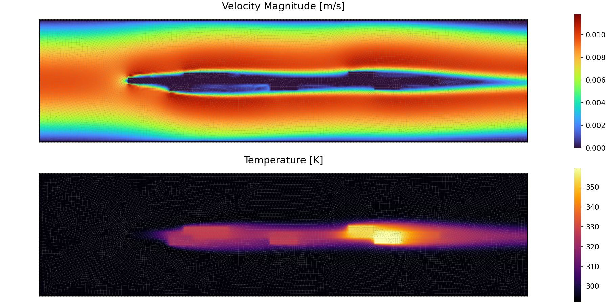

# GeoFNO: Geometric Fourier Neural Operator for Conjugate Heat Transfer



## Table of Contents
1. [Project Overview](#project-overview)
2. [Data Generation: FEM Simulations](#data-generation-fem-simulations)
3. [Neural Network: GeoFNO Architecture](#neural-network-geofno-architecture)
4. [Practical Usage](#practical-usage)

---

## Project Overview

The workflow consists of two main components:

1. **Data Generation**: High-fidelity FEM simulations of laminar fluid flow and heat transfer over electronic components
2. **Neural Network**: GeoFNO learns to predict temperature, pressure, and velocity fields from geometry and boundary conditions

---

# Data Generation: FEM Simulations

## 1. Simulation Overview

The data generation pipeline simulates **laminar, steady-state airflow** over a Printed Circuit Board (PCB) with mounted electronic components inside a cooling channel. The simulation solves coupled physics:
- **Incompressible Navier-Stokes equations** (fluid flow)
- **Advection-diffusion equation** (heat transfer)

Both are solved using the **Finite Element Method (FEM)** with the `scikit-fem` library.

### Fixed Data & Parameters

The physical setup uses properties of **Air at 20°C** and standard PCB geometry:

| Parameter | Value | Description |
| :--- | :--- | :--- |
| **Domain Size** | $20.0 \times 5.0$ m | Rectangular channel |
| **PCB Geometry** | Width: 14.0, Height: 0.25 m | Centered in the domain |
| **Kinematic Viscosity** ($\nu$) | $1.0 \times 10^{-5}$ $m^2/s$ | Air viscosity |
| **Inlet Velocity**| Variable | Parabolic profile |
| **Solid Components** | 5 Components | Modeled as obstacles with heat sources |
| **Thermal Conductivity (Air)** | 0.0263 $W/m\cdot K$ | Air conductivity |
| **Thermal Conductivity (Solid)** | Variable | High conductivity |
| **Power Dissipation** | Variable per component | Heat sources in solids |

**Boundary Conditions:**

*Fluid Flow:*
- **Inlet**: Prescribed parabolic velocity profile
- **Outlet**: Natural boundary condition (traction-free)
- **Walls & Solids**: No-slip condition ($\mathbf{u} = 0$)

*Heat Transfer:*
- **Inlet**: Fixed temperature (ambient)
- **Outlet**: Natural boundary condition
- **Walls**: Adiabatic (no heat flux)
- **Solid Components**: Internal heat generation (power dissipation)

---

## 2. Mesh Generation

The mesh is generated using the **GMSH** Python API. The generation process is handled in `data_generation/generate_mesh.py`.
**Strategy**: Conformal quadrilateral meshing. Solid components are fragmented from the fluid domain to ensure continuous nodes at interfaces.

---

## 3. Mathematical Formulation

This project solves the coupled system of fluid dynamics and heat transfer using the **Finite Element Method (FEM)**. The solver is built on `scikit-fem` and utilizes custom Numba-accelerated kernels for the efficient assembly of stabilization terms.

### 3.1 Fluid Dynamics: Incompressible Navier-Stokes

The fluid flow is governed by the steady-state incompressible Navier-Stokes equations. We solve for the velocity field $\mathbf{u} = (u_x, u_y)$ and the kinematic pressure field $p$:

$$
\begin{aligned}
(\mathbf{u} \cdot \nabla) \mathbf{u} - \nu \Delta \mathbf{u} + \nabla p &= 0 \quad \text{in } \Omega_f \\
\nabla \cdot \mathbf{u} &= 0 \quad \text{in } \Omega_f
\end{aligned}
$$

Where $\nu$ is the kinematic viscosity ($1.0 \times 10^{-5} \, m^2/s$).

#### Discretization (Taylor-Hood Elements)
To satisfy the **LBB (Ladyzhenskaya-Babuska-Brezzi)** inf-sup condition and ensure numerical stability, we employ **Taylor-Hood ($P_2-P_1$)** mixed elements:
- **Velocity Space ($\mathbf{V}_h$):** Continuous piecewise Quadratic ($P_2$) elements (`ElementVectorH1(ElementQuad2)`).
- **Pressure Space ($Q_h$):** Continuous piecewise Linear ($P_1$) elements (`ElementQuad1`).

#### Linearization (Picard Iteration)
The convective term $(\mathbf{u} \cdot \nabla)\mathbf{u}$ is non-linear. We resolve this using **Picard Iterations** (Fixed Point method). At each iteration $k$, the convective velocity is frozen from the previous step:

$$
(\mathbf{u}^{k} \cdot \nabla) \mathbf{u}^{k+1} - \nu \Delta \mathbf{u}^{k+1} + \nabla p^{k+1} = 0
$$

The loop continues until the relative error drops below the tolerance $\epsilon = 5 \times 10^{-3}$.

### 3.2 Stabilization Techniques (VMS)

Standard Galerkin FEM is inherently unstable for convection-dominated flows (high Reynolds numbers). We implement a **Variational Multiscale (VMS)** formulation with three specific stabilization terms added to the weak form.

#### A. SUPG (Streamline-Upwind Petrov-Galerkin)
To prevent spurious node-to-node oscillations in the velocity field, we add diffusion strictly along the flow streamlines. The stabilization term is:

$$
S_{SUPG} = \sum_{K} \tau_K \left( (\mathbf{u}^k \cdot \nabla \mathbf{u}^{k+1} + \nabla p) \cdot (\mathbf{u}^k \cdot \nabla \mathbf{v}) \right)_K
$$

The stabilization parameter $\tau_K$ is calculated dynamically per element based on the local element size $h$ and velocity magnitude $|\mathbf{u}|$:

$$
\tau_K = \frac{\delta_{supg}}{\sqrt{ \left(\frac{2 |\mathbf{u}|}{h}\right)^2 + \left(\frac{36 \nu}{h^2}\right)^2 }}
$$

Where $\delta_{supg} = 0.5$.

#### B. Grad-Div Stabilization
This term penalizes the divergence of the velocity field to improve mass conservation and the coupling between velocity and pressure blocks.

$$
S_{GradDiv} = \gamma |\mathbf{u}| h (\nabla \cdot \mathbf{u}) (\nabla \cdot \mathbf{v})
$$

Where $\gamma = 0.1$ is the scaling factor (`DELTA_GRADDIV`).

#### C. Pressure Penalty Regularization
To ensure the solvability of the linear system and remove hydrostatic pressure modes, a small penalty term is subtracted from the continuity equation:

$$
S_{Penalty} = - \epsilon p q
$$

Where $\epsilon = 10^{-6}$ (`EPS_PENALTY`). This relaxes the incompressibility constraint slightly to $\nabla \cdot \mathbf{u} + \epsilon p = 0$.

#### Final Stabilized Weak Form (Navier-Stokes)

Find the solution $(\mathbf{u}^{k+1}, p^{k+1}) \in \mathbf{V}_h \times Q_h$ such that for all test functions $(\mathbf{v}, q) \in \mathbf{V}_h \times Q_h$, the following residual equation is satisfied:

$$
\begin{aligned}
\mathcal{R}(\mathbf{u}^{k+1}, p^{k+1}; \mathbf{v}, q) &= \\
&\quad \underbrace{ \int_\Omega \nu \nabla \mathbf{u}^{k+1} : \nabla \mathbf{v} \, d\Omega - \int_\Omega p^{k+1} (\nabla \cdot \mathbf{v}) \, d\Omega - \int_\Omega q (\nabla \cdot \mathbf{u}^{k+1}) \, d\Omega }_{\text{Standard Galerkin (Viscous + Pressure + Continuity)}} \\
&\quad + \underbrace{ \int_\Omega [(\mathbf{u}^k \cdot \nabla) \mathbf{u}^{k+1}] \cdot \mathbf{v} \, d\Omega }_{\text{Convection (Picard Linearized)}} \\
&\quad - \underbrace{ \int_\Omega \epsilon \, p^{k+1} q \, d\Omega }_{\text{Penalty Regularization}} \\
&\quad + \underbrace{ \sum_{K \in \mathcal{T}_h} \int_K \tau_K \left( (\mathbf{u}^k \cdot \nabla) \mathbf{u}^{k+1} + \nabla p^{k+1} \right) \cdot \left( (\mathbf{u}^k \cdot \nabla) \mathbf{v} \right) \, d\Omega }_{\text{SUPG Stabilization}} \\
&\quad + \underbrace{ \sum_{K \in \mathcal{T}_h} \int_K \gamma \|\mathbf{u}^k\| h_K (\nabla \cdot \mathbf{u}^{k+1}) (\nabla \cdot \mathbf{v}) \, d\Omega }_{\text{Grad-Div Stabilization}} = 0
\end{aligned}
$$


**Where:**
* $\mathbf{u}^k$: Velocity field from the previous iteration (Frozen).
* $\nu$: Kinematic viscosity (`1e-5`).
* $\epsilon$: Penalty parameter (`1e-6`).
* $\tau_K$: SUPG stabilization parameter (dynamic per element).
* $\gamma$: Grad-Div scaling factor (`0.1`).
* $h_K$: Local element size.

### 3.3 Conjugate Heat Transfer

After obtaining the converged velocity field $\mathbf{u}$, we solve the linear Advection-Diffusion equation for temperature $T$ over the entire domain (Fluid + Solid):

$$
\rho c_p (\mathbf{u} \cdot \nabla T) - \nabla \cdot (k(\mathbf{x}) \nabla T) = Q(\mathbf{x})
$$

- **Coupling:** One-way coupling. The velocity $\mathbf{u}$ is interpolated from the fluid solution onto the thermal mesh.
- **Conductivity ($k$):** Spatially varying field defined in `data.py`:
  - Air: $k \approx 0.0263 \, W/m\cdot K$
  - PCB: $k = 0.3 \, W/m\cdot K$
  - Components: $k \in [200, 500] \, W/m\cdot K$
- **Heat Source ($Q$):** Non-zero volumetric heat generation only within the electronic component subdomains ($10W$ to $30W$ per component).

---

### 3.4 Data Storage

For each simulation case, the following files are saved:

```
dataset/case_XXXX/
├── mesh.msh              # GMSH mesh file
├── inputs.npy            # Input fields: {conductivity, power}
├── solutions.npy         # Output fields: {temperature, pressure, vx, vy}
├── fluid_solution.png    # Visualization of velocity field
└── thermal_solution.png  # Visualization of temperature field
```

**Data Format:**
- `inputs.npy`: Dictionary with node-wise values
- `solutions.npy`: Dictionary with node-wise values
- All arrays have shape `(N_nodes,)` where nodes correspond to mesh vertices

---

# Neural Network: GeoFNO Architecture

**Goal:** Solve conjugate heat transfer PDEs on irregular geometries by bridging finite element mesh (FEM) data with grid-based Neural Operators.

## 1. Input Data & Processing
The model inputs **6 physical channels** interpolated onto a regular **128×128 grid**:
* **Channels:** `[conductivity, power, grid_x, grid_y, solid_mask, vel_inlet]`
* **Mesh-to-Grid Strategy:**
    * **Hybrid Interpolation:** Uses Linear interpolation for smoothness inside the mesh and Nearest-Neighbor to fill boundaries/NaNs.
    * **Normalization:** Global Z-score standardization ($x_{norm} = \frac{x - \mu}{\sigma}$); stats cached for consistency.

## 2. Encoder (Grid-Based)
* **Layer:** `nn.Conv2d(6, 128, kernel_size=1)`
* **Function:** Projects the multi-channel physical input into a 128-dimensional high-level feature space.

## 3. Core Architecture: FNO Blocks
A stack of **6 FNO Blocks** processes features in the frequency domain.

**Block Structure:**
1.  **Spectral Path:** FFT $\rightarrow$ Linear Transform (16 modes) $\rightarrow$ IFFT.
    * *Captures global, low-frequency patterns.*
2.  **Spatial Path:** Standard $1\times1$ Convolution.
    * *Captures local, high-frequency details.*
3.  **Normalization:** `InstanceNorm2d` (chosen over BatchNorm to handle varying geometry instances).
4.  **Activation:** GELU.
5.  **Residual Connection:** Adds input to output for stable deep training.

## 4. Decoder: Geometric Querying (Key Innovation)
Unlike standard FNOs that output grids, GeoFNO predicts values at exact, irregular mesh nodes.

1.  **Grid-to-Mesh Interpolation:**
    * Uses `F.grid_sample(latent_grid, query_coords, mode='bilinear')` to sample the 128 learned features at specific $(x, y)$ mesh locations.
2.  **Coordinate Injection:**
    * Explicitly concatenates physical coordinates to the sampled features:
        `Input = [Latent Features (128) + Physical Coords (2)]` $\rightarrow$ 130 dims.
3.  **MLP Head:**
    * `Linear(130, 130)` $\rightarrow$ GELU $\rightarrow$ Dropout (0.1) $\rightarrow$ `Linear(130, 1)`
    * Outputs the scalar **Temperature** field.

## 5. Training Configuration
* **Loss Function:** Mean Squared Error (MSE). Evaluated via Relative L2 Error.
* **Optimizer:** AdamW (`lr=5e-2`, `weight_decay=1e-4`) with Gradient Clipping (`max_norm=1.0`).
* **Scheduler:** StepLR (Decays $lr$ by 0.5 every 20 epochs).
* **Augmentation:**
    * **Random Flip:** Horizontal flipping (50%).
    * **Random Rotation:** Discrete rotations ($0^\circ, 90^\circ, 180^\circ, 270^\circ$) to exploit physical symmetries and expand dataset size.

---

# Practical Usage

## Project Structure

```
GeoFNO/
├── data_generation/
│   ├── mesh.py                # Mesh generation utility
│   ├── solve_fluid.py         # Navier-Stokes solver (FEM)
│   ├── solve_thermal.py       # Heat transfer solver (FEM)
│   ├── data.py                # Material properties and domain settings
│   ├── generate_data.py       # Main script to run full simulations
│   └── dataset/               # Generated FEM data
│       └── case_XXXX/
│           ├── mesh.msh       # Conformal mesh file
│           ├── inputs.npy     # Field inputs (k, power)
│           ├── solutions.npy  # Solution fields (T, P, u, v)
│           ├── params.pkl     # Case parameters (e.g., vel_inlet)
│           └── simulation.png # Visualization of FEM result
├── NN/
│   ├── model.py               # GeoFNO network architecture
│   ├── loader.py              # Parallel dataset loading and grid interpolation
│   ├── train.py               # Training and evaluation loop
│   ├── utils.py               # Collation, augmentation, and visualization
│   └── results/               # Training outputs
│       ├── best_model.pth     # Trained weights
│       ├── training_history.png
│       └── test_examples/     # Prediction visualizations
└── README.md
```

---

## Installation

### Requirements

```bash
# Create virtual environment
python -m venv .venv
source .venv/bin/activate  # On Windows: .venv\Scripts\activate

# Install dependencies
pip install torch torchvision  # Or use conda for CUDA support
pip install scikit-fem meshio gmsh numpy scipy matplotlib pypardiso
```

**Key Dependencies:**
- `torch`: Neural network framework
- `scikit-fem`: FEM solver
- `gmsh`: Mesh generation
- `meshio`: Mesh I/O
- `pypardiso`: Fast sparse linear solver (optional but recommended)

---

## Workflow

### Step 1: Generate Training Data

```bash
cd data_generation
python generate_data.py
```

**What it does:**
1. Generates random geometries (component positions and sizes).
2. Sets random boundary conditions (variable inlet velocity).
3. Solves the coupled fluid-thermal problem using scikit-fem.
4. Saves high-quality data and visualizations for training.

**Configuration:**
- Edit `data.py` to change domain dimensions or physical constants.
- The script uses parallel processing to speed up generation.

---

### Step 2: Train Neural Network

```bash
cd NN
python train.py
```

**What it does:**
1. Loads all cases from the dataset directory in parallel.
2. Interpolates mesh data onto a 128x128 grid for spectral processing.
3. Pre-pads all samples for efficient batch processing.
4. Trains the GeoFNO model with MSE loss and AdamW optimizer.
5. Employs early stopping and learning rate decay.
6. Automatically saves visualizations of predictions in `results/test_examples/`.

**Configuration:**
Edit `train.py` to change:
- `BATCH_SIZE`: Default 8.
- `EPOCHS`: Default 2000.
- `LR`: Learning rate (default 5e-2).
- `PATIENCE`: Early stopping patience (default 50).
